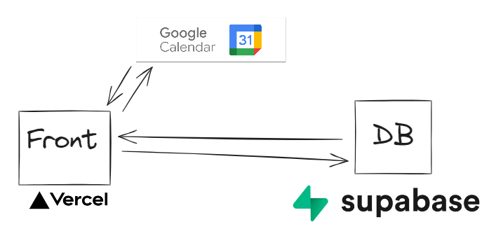
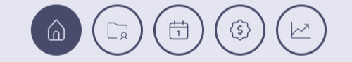
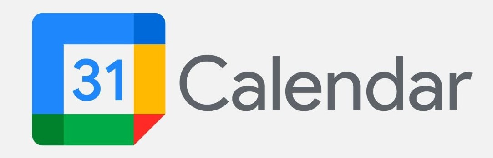

<p align="center">
  
</p>
<p align="center">
    <h1 align="center">CRM</h1>
</p>

## Project Overview 📠

CRM it's a database fully integrated with google calendar, built for financial advisors to manage clients and team statistics - [CRM](https://crm-wine-nine.vercel.app/), but it also includes some cool features. Enjoy!

## Tech/framework used 🧰

<p align="center">
    
    
     
    
	
    
    
    
    
</p>

| Tech                                                                   | Description                                             |
| ---------------------------------------------------------------------- | ------------------------------------------------------- |
| [TypeScript](https://www.typescriptlang.org/)                          | Static type-checking programming language               |
| [React](https://reactjs.org/)                                          | Library for building user interfaces                    |
| [Chakra UI](https://v2.chakra-ui.com/)                                 | Component Librairy                                      |
| [Supabase](https://supabase.com/)                                      | Open source database                                    |
| [TanStack Query v5](https://tanstack.com/query/latest)                 | asynchronous state management for TS/JS                 |
| [Axios](https://github.com/axios/axios)                                | Promise based HTTP client for the browser and node.js   |
| [TanStack Table v8](https://tanstack.com/table/latest)                 | Table API                                               |
| [React Big Calendar](https://www.npmjs.com/package/react-big-calendar) | events calendar component built for ReactAPI            |
| [Formik](https://react-hook-form.com)                                  | Forms with easy-to-use validation                       |
| [Yup](https://github.com/jquense/yup)                                  | schema builder for runtime value parsing and validation |
| [Husky](https://github.comtypicode/husky)                              | Git hooks                                               |
| [ESLint](https://eslint.org/)                                          | TypeScript linting                                      |
| [Prettier](https://prettier.io/)                                       | Code formatter                                          |

## Architecture



## Local development

```Prerequisite
Node.js v20.*
git clone https://github.com/Kryskar/CRM
npm install
cp .env.example .env
# set up environment variables
npm run dev
```

## Scripts

```
dev - running app locally
build - build app
lint - app linting using eslint
lint-fix - app linting and fixing auto fixable problems
preview - run built app
prettier - prettify code
prepare - script for husky
```

## Live 🎆

Demonstration version:

https://crm-wine-nine.vercel.app/

## Usage 💿

Just log in to the live environment with the test user data provided below and try it out yourself.

Working with the application begins by logging in with a Google account authorized by the administrator.

Structure:



- Home page
- Current clients database
- Calendar
- Finalized clients database
- Statistics

<b>Home Page:</b>

The home page consists of three main sections. In the center, there is a changelog where we can see the current changes made by team members. Every change in the client’s status is visible in the changelog. On the left side, there is a panel with quick statistics. This is a condensed version of the analytics tab, allowing us to switch between our own statistics and the team statistics. On the right side, we have access to the calendar. This is a compact version of the calendar tab with the current tasks to be completed.

<b>Current Clients Database:</b>

The clients' database contains a table with clients.

Statuses:

- <span style="color:#007FFF;">call to client</span>
- <span style="color:#4cca36;">chance</span>
- <span style="color:#4cca36;">not answering phone call</span>
- <span style="color:#4cca36;">client is considering the offer</span>
- <span style="color:#4cca36;">waiting for documents</span>
- <span style="color:#4cca36;">recieved documents</span>
- <span style="color:#4cca36;">loan application submitted in bank</span>
- <span style="color:#4cca36;">loan application accepted in bank</span>
- <span style="color:#4cca36;">loan application rejected in bank</span>
- <span style="color:#4cca36;">success</span>
- <span style="color:#4cca36;">rejected by client</span>
- <span style="color:#4cca36;">success - reported</span>
- <span style="color:#FF007F;">not doable</span>

<span style="color:#007FFF;">call to client</span> is the basic status, which a client receives immediately after being added. When a user adds a client, this status is assigned, and a calendar event is created with the same day the client was added. The default table view is set to clients with the status call client since they should be serviced the fastest. When the status changes from call client to any other, an agent is assigned to that client.

After talking to the client, the user can decide which status to change to. <span style="color:#4cca36;">Green statuses,</span> represent further processing of the client, while if the user determines that they cannot help the client, they choose the red status <span style="color:#FF007F;">not doable</span> which ends the processing of the client. At any time, it is possible to revive the client by changing from <span style="color:#FF007F;">not doable</span> to one of the green statuses.

<b>Calendar:</b></br>



The Calendar tab is actually a copy of the Google calendar associated with the user's Google account, where we can manually add, change or delete an event. The application is fully integrated with the Google calendar, so all events in the user's Google calendar are visible in the calendar tab. Any event change or deletion will be reflected both in the CRM application and in the user's Google account.

<u>Integration demo video:</u> https://www.youtube.com/watch?v=hKdOYG5AjKk

<b>Finalized Clients Database:</b></br>

When the sales process is finalized by selecting the <span style="color:#4cca36;">success</span> status in the <b>Current Clients Database</b> tab, a "report success" button next to the client appears. The report requires to select a bank and fulfill the sales conditions, i.e. interest rate, commission and loan period. After reporting, the client goes to the Table of finalized clients, where the list of all finalized clients can be seen, as well as the list of finalized clients of each user individually.

<b>Statistics:</b></br>

this is a tab with analytics for the entire team and for each individual. </br>
stats below 50% of the plan are displayed in <span style="color:#FF007F;">red</span></br>
50%-100% on <span style="color:#FDB913;">orange</span> </br>
over 100% on <span style="color:#4cca36;">green</span>
The tab contains charts and a ranking of team members

## Contact

E-mail 📧 : karol.kryskiewicz@gmail.com </br>
